 

  

#

Giovane, Desenvolvedor Full Stack em formação e estudante de Ciência da Computação. Desenvolvo soluções web e projetos completos, explorando diferentes tecnologias para transformar ideias em aplicações funcionais. Sempre em busca de novos desafios e evolução na programação..

#

<h3 align="left">Connect with me!</h3>

<h3 align="left">My Stack ~</h3>

 
 

<h3 align="left">GitHub Stats</h3>

  

  

 

<picture align="center">
  <source media="(prefers-color-scheme: dark)" srcset="https://raw.githubusercontent.com/giovaneng/giovaneng/output/github-contribution-grid-snake-dark.svg">
  <source media="(prefers-color-scheme: light)" srcset="https://raw.githubusercontent.com/giovaneng/giovaneng/output/github-contribution-grid-snake-dark.svg">
  
</picture>
